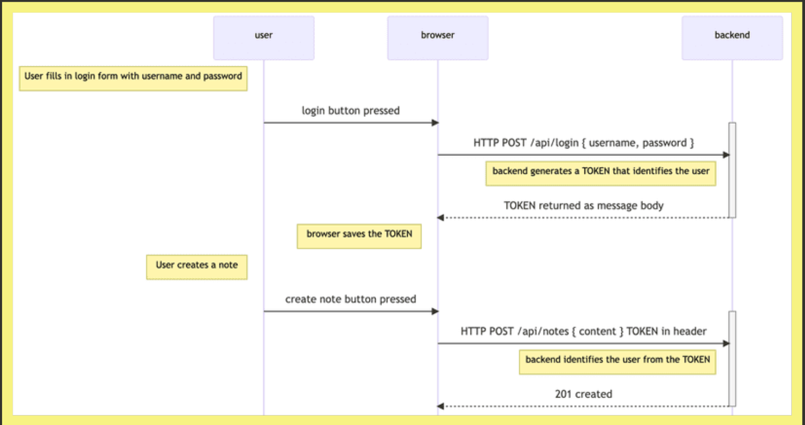

# limiting-creating-notes-to-logged-in-users

## Token Based Authentication

* The principles of token-based authentication are depicted in the following sequence diagram:



* User starts by logging in using a login form implemented with React

* This causes the React code to send the username and the password to the server address /api/login as an HTTP POST request.

* If the username and the password are correct, the server generates a token that somehow identifies the logged-in user.

    * The token is signed digitally, making it impossible to falsify (with cryptographic means)

* The backend responds with a status code indicating the operation was successful and returns the token with the response.

* The browser saves the token, for example to the state of a React application.

* When the user creates a new note (or does some other operation requiring identification), the React code sends the token to the server with the request.

* The server uses the token to identify the user

---

## JWT - JSON_WEB_TOKEN

### Process.env.SECRET ??

1. What is SECRET? (The Cryptographic Stamp 🔏)

    * A JSON Web Token (JWT) consists of 3 parts separated by dots:

        * HEADER . PAYLOAD . SIGNATURE

            * **Header**: Contains metadata (e.g., algorithm HS256).

            * **Payload**: The user data (e.g. { username: "vinayak", id: "65f29..." }).

            * **Signature**: The cryptographic stamp that proves YOUR backend created this token and no hacker modified it!
    
    ---

    * How the Signature is Generated:

        When a user logs in with valid credentials, your backend signs the token:

        const token = jwt.sign(userForToken, process.env.SECRET) // userForToken === data , SECRET === process.env.SECRET

        * The mathematical formula under the hood
        Signature = HMAC-SHA256( Header + payload , SECRET)

---
    
2. What happens if a hacker tries to tamper with the token?

    * Imagine a hacker receives a token for username ""vinayak"". They edit the payload in the browser to say: { username: "admin" }

        * When they send that fake token back to your server:

            1. Your server runs jwt.verify(token, process.env.SECRET).

            2. The server re-calculates the signature using your SECRET.

            3. The signature fails to match!

            4. The server instantly throws JsonWebTokenError: invalid signature and rejects the hacker with 401 Unauthorized

    ---

    * 🚨 Why SECRET MUST be in .env (Never in code!):

        * If a hacker discovers your SECRET string (e.g. if you accidentally push it to GitHub):

            * The hacker can generate valid tokens for any user or admin without needing passwords!

            * That is why SECRET is kept strictly inside .env (and never pushed to git).


---

3. What should you actually type in .env?

* In your .env file, add a new line named SECRET with any long, random, hard-to-guess string:

```
MONGODB_URI=...
TEST_MONGODB_URI=...
PORT=...
SECRET=...
```

* (In high-security production companies, we generate a 64-character random string using crypto.randomBytes(32).toString('hex'), but for development and course exercises, any strong random string is perfect).


### In one sentence: **SECRET** _is your backend's private signing stamp_ used to verify that incoming JWT tokens are authentic and unmodified.Does that make the purpose of SECRET crystal clear

* node -e "console.log(require('crypto').randomBytes(32).toString('hex'))"

